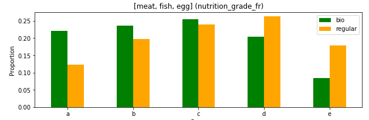
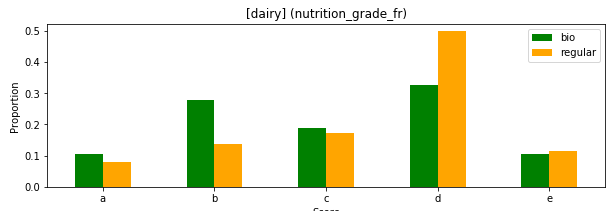
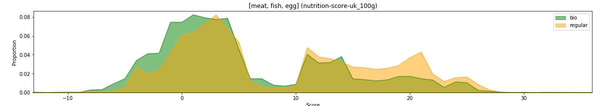
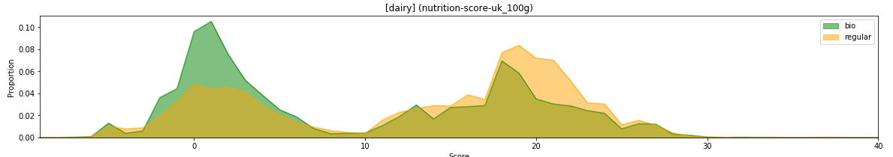

# Free Diving into Food Facts

## Open Food Facts dataset

### Nutritional scores

#### UK

nutrition-score-uk_100g 

#### France

#### Nova

## Comparing bio and regular products

Are bio products really healthier? Let us try to get an intuition by observing the score on bio and non-bio product for different food categories. 

To do so, we will observe groups of products that were chosen based on their categories. We can therefore compare meat related products or dairies independently. It would be interesting to see whether bio and non-bio products show different characteristics based on their categories. 

Let us start with their french nutrition grade:

- Nutritional scores
- Additives
- Nova groups 
- Composition 