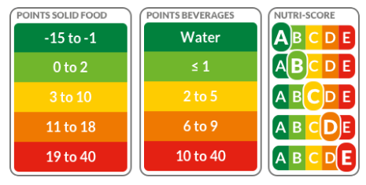

# {{ site.title }}

Nowadays, most products come in two flavors: bio or non-bio. Consequently, while shopping, we are always confronted to bio products whose costs are about 20-40% higher than their non-bio equivalent. Such a price increase must imply a more responsible production and therefore better product quality, right? **So concretely, are bio products healthier than regular ones?**

### Open Food Facts

To explore this question, we based our exploration on the [Open Food Facts](https://fr.openfoodfacts.org/) dataset, regrouping millions of products from all around the world, while the majority of the products originate from France and the USA. It provides insights on their composition, nutritional score, the place they are sold and many other information.  A complete list of all the fields available can be found [here](https://static.openfoodfacts.org/data/data-fields.txt).

There is even an [app](https://play.google.com/store/apps/details?id=org.openfoodfacts.scanner&hl=fr_CH) based on the dataset which allows the user to scan the bar-code of a product and immediately get an evaluation of the product.

#### Product categories

To carry out a more rigorous analysis, we split the Open Food Facts dataset into *8 categories of products*:
* Meat, fish, egg
* Fruit, vegetable
* Cereal based
* beverages
* Dairy
* Oil, butter
* Spices, salsa, condiments
* Sugary products

If you are curious about which kind of products goes into each category, you can have a look at the following wordclouds. The common product names are bigger:

**TODO: change plot number**
{::nomarkdown}
<iframe id="igraph" scrolling="no" style="border:none;" seamless="seamless" src="https://plot.ly/~inutile/10.embed" height="525" width="100%"></iframe>
{:/}

Let us start our investigations with the nutrition scores. But first, some definitions.

## Nutritional scores

Open Food Facts contains two scores that can be used to evaluate a product:

- **French and UK Nutri-score**: The Nutri-Score is a nutrition label that converts the nutritional value of products into a simple code consisting of 5 letters, each with its own color. The aim of this code is to help consumers take into account the nutritional quality of the products they are buying.

  Each product is then awarded a score based on a formula that takes into account the nutrients to avoid (energy value and the amount of sugars, saturated fats and salt) and the positive ones (the amount of fiber, protein, fruit, vegetables and nuts).  The UK score is essentially a finer version of the French score. It is therefore possible to see at a glance which products are recommended and which should be avoided.

  

  

- **NOVA group**:  NOVA helps people group foods according to the extent and purpose of the processing they undergo. Food processing as identified by NOVA involved physical, biological and chemical processes that occur after foods are separated from nature, and before they are consumed or used in the preparation of dishes and meals.

   The values of this group are {1,2,3,4}

  - Group 1 - Unprocessed or minimally processed foods: Unprocessed (or natural) foods are edible parts of plants (seeds, fruits, leaves, stems, roots) or of animals (muscle, offal, eggs, milk), and also fungi, algae and water, after separation from nature.
  - Group 2 - Processed culinary ingredients: Processed culinary ingredients, such as oils, butter, sugar and salt, are substances derived from Group 1 foods or from nature by processes that include pressing, refining, grinding, milling and drying.
  - Group 3 - Processed foods: Processed foods, such as bottled vegetables, canned fish, fruits in syrup, cheeses and freshly made breads, are made essentially by adding salt, oil, sugar or other substances from Group 2 to Group 1 foods.
  - Group 4 - Ultra-processed food and drink products: Ultra-processed foods, such as soft drinks, sweet or savory packaged snacks, reconstituted meat products and pre-prepared frozen dishes.

## Is Bio better?

Nowadays, most products come in two flavors: bio or non-bio. Consequently, while shopping, we are always confronted to bio products whose costs are about 20-40% higher than their non-bio equivalent. Such a price increase must imply a more responsible production and therefore better product quality, right?

But are bio products really healthier? Let us try to get a first intuition by observing the score on bio and non-bio products for different food categories.

### French nutrition grade

To do so, let us observe groups of products that were chosen based on their categories. As an example, one could observe meat related products independently.

Let us start with their french nutrition grade:

{::nomarkdown}
<iframe id="igraph" scrolling="no" style="border:none;" seamless="seamless" src="https://plot.ly/~inutile/10.embed" height="525" width="100%"></iframe>
{:/}

Interestingly, while bio and non-bio scores distributions are similar, the bio products have greater proportions of products related to better scores while this tendency is inverted for the non-bio products. This is a first hint that bio products may indeed be healthier.

What about another score? Let us look at what the UK nutrition score has to tell us.

### UK nutrition grade

{::nomarkdown}
<iframe id="igraph" scrolling="no" style="border:none;" seamless="seamless" src="https://plot.ly/~inutile/15.embed" height="525" width="100%"></iframe>
{:/}

The same conclusion arises from these last graphs. While both distributions have similar shape, bio products have larger proportions of products with better nutrition score than non-bio products.

### Nova group

Does the degree of transformation of the products have something to do with it? Let us see if any tendency is observable:

{::nomarkdown}
<iframe id="igraph" scrolling="no" style="border:none;" seamless="seamless" src="https://plot.ly/~inutile/6.embed" height="525" width="100%"></iframe>
{:/}

Well... While both categories show relatively high levels of processing, the bio products tend to still have slightly better scores. They indeed tend to be less processed, which contributes to their nutritional scores.

### So what now?

The previous scores tend to be in favor of the bio products.

**Do other properties also corroborate this claim?** Let us go through 2 more criteria:

- Nutrition facts
- Additives

### Why is bio better then?

#### Nutrition facts

Although the nutrition facts directly impact their nutritional scores, it is interesting to go a bit deeper into the products composition.

**Goal**: Identify the nutriments that really impact both classes (hence find what makes the difference between the two classes).  Find out where the difference is for each class.

#### Additives

>  **TODO:** Add correlation map. Illustrate whether additives have impact on nutrition scores.

What about the additives then? They are often source of controversy, and some are even believed to be cancerous. Let us recall the main types of additives, as listed in [Wikipedia](https://en.wikipedia.org/wiki/Food_additive) (check [this page](https://en.wikipedia.org/wiki/E_number) for a more in depth listing):

- **Antibiotics** (E700–E799)
- **Antioxidants/acidity regulators** (E300–E399, used for controlling the [pH](https://en.wikipedia.org/wiki/PH) of foods for stability or to affect activity of enzymes)
- **Colorants** (E100–E199, enhance or add colors to the product)
- **Flavor enhancers** (E600–E699, enhance the food's existing flavor. Some flavor enhancers have their own flavors that are independent of the food.)
- **Glazing agents, gases and sweeteners** (E900–E999, provide a shiny appearance or protective coating to foods)
- **Preservatives** (E200–E299, prevent or inhibit spoilage of food due to [fungi](https://en.wikipedia.org/wiki/Fungus), [bacteria](https://en.wikipedia.org/wiki/Bacteria) and other [microorganisms](https://en.wikipedia.org/wiki/Microorganism))
- **Thickeners, stabilizers and emulsifiers** (E400–E499, increase the product's [viscosity](https://en.wikipedia.org/wiki/Viscosity) without substantially modifying its other properties)
- **pH regulators and anti-caking agents** (E500–E599, keep powders such as milk powder from caking or sticking)

Considering the same groups of products, let us observe the presence of additives in each category.

{::nomarkdown}
<iframe id="igraph" scrolling="no" style="border:none;" seamless="seamless" src="https://plot.ly/~inutile/8.embed" height="525" width="100%"></iframe>
{:/}

That is interesting! The proportions of additives is in general drastically different when looking at bio products vs. regular ones. Less additives are to be found in bio products. But do they actually impact the nutritional scores?

## Nutrient composition

On most products that are sold in a supermarket, there is a table on the back of the packaging, indicating the quantities of nutrients (sugar, salt, fat, fibers, ...) contained in a portion of 100g of the product. This is quite useful to know when is inside a product, and can help consumers decide on one product or the other.

The average quantity of the main nutrients contained in the products is shown in the following figure, for each category.

{::nomarkdown}
<iframe id="igraph" scrolling="no" style="border:none;" seamless="seamless" src="https://plot.ly/~inutile/21.embed" height="525" width="100%"></iframe>
{:/}

There are quite a few interesting remarks that can be made regarding the results:
* There is less salt in organic products than in regular ones, whatever the category.
* The quantities of fat is similar for regular and organic products, except for the `Meat, fish, egg` category. In this case, there is clearly less fat in organic products. For meat and fish, this is usually a sign of better quality.
* The quantity of proteins and sugar are similar for organic and regular products.
* There are more fibers and traces of fruit in organic products. This is highlighting the fact that the products are less processed than regular ones. This is especially striking in the `Beverage` category.

## Tout doux ma gueule

> *Hypothesis*: companies that make the effort to produce bio products also the effort to make healthy products.

## Conclusion

**TODO but overall difference between regular/organic.**

**TODO: change all occurences of bio with organic .**
