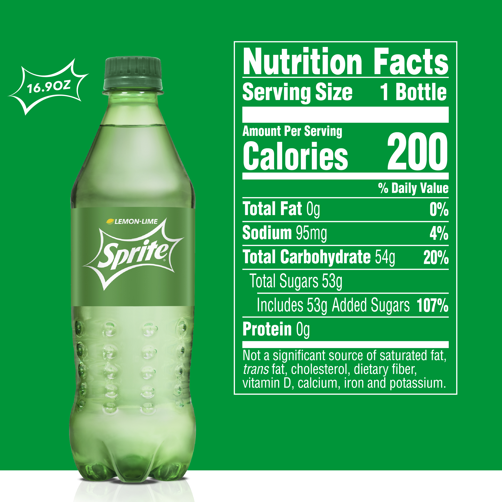

# {{ site.title }}

Nowadays, most products come in two flavors: bio or standard. Consequently, while shopping, we are always confronted to bio products whose costs are about 20-40% higher ([source](https://www.consumerreports.org/cro/news/2015/03/cost-of-organic-food/index.htm)) than their standard equivalent. Such a price increase must imply a more responsible production and therefore better product quality, right? **So concretely, are bio products healthier than regular ones?**

### Open Food Facts

To explore this question, we based our exploration on the [Open Food Facts](https://fr.openfoodfacts.org/) dataset, regrouping millions of products from all around the world, while the majority of the products originate from France and the USA. It provides insights on their composition, nutritional score, the place they are sold and many other information.  A complete list of all the fields available can be found [here](https://static.openfoodfacts.org/data/data-fields.txt).

There is even an [app](https://play.google.com/store/apps/details?id=org.openfoodfacts.scanner&hl=fr_CH) based on the dataset which allows the user to scan the bar-code of a product and immediately get an evaluation of the product.

#### Product categories

To correctly compare these two categories, one should be careful with what products are actually being compared to avoid comparing oil with salad, for instance. Hence, to carry out a more rigorous analysis, we split the Open Food Facts dataset into *8 categories of products*:
* Meat, fish, egg
* Fruit, vegetable
* Cereal based
* beverages
* Dairy
* Oil, butter
* Spices, salsa, condiments
* Sugary products

All these categories actually embeds different subcategories that were merged for our analysis. If the reader is curious about which kind of products goes into each category, he have a look at the following wordclouds. The bigger the word, the most common is the product.

**TODO: change plot number and actually show correct plot**
{::nomarkdown}
<iframe id="igraph" scrolling="no" style="border:none;" seamless="seamless" src="https://plot.ly/~inutile/10.embed" height="525" width="100%"></iframe>
{:/}

**TODO would be super nice to have the main question written in huge on the screen at this point.**
Now that the data is ready, let's dive into the main question of this analysis being: **Are bio products better than standard products ?**

Let's start the investigations with the nutrition scores. But first, some definitions.

**TODO : As I already mentioned, the switch between questions should be marked with a big header, to actually illustrate better the switch between main investigations**

**TODO: enlever ça et simplement introduire qu'on dive dans l'analyse des nutrition scores**
## Is Bio better?

Nowadays, most products come in two flavors: bio or standard. Consequently, while shopping, we are always confronted to bio products whose costs are about 20-40% higher than their standard equivalent. Such a price increase must imply a more responsible production and therefore better product quality, right?

But are bio products really healthier? Let us try to get a first intuition by observing the score on bio and standard products for different food categories.

### French nutrition grade

The French Nutri-Score is a nutrition label that converts the nutritional value of a product into a simple letter. There are 5 letters in total, each with its own color, A being the best and E the worst. 

The score is based on a formula that takes into account the properties to avoid (high energy values and the amount of sugars, saturated fats and salt) and the positive ones (the amount of fibers, proteins, fruit, vegetables and nuts). 

{::nomarkdown}
<iframe id="igraph" scrolling="no" style="border:none;" seamless="seamless" src="https://plot.ly/~inutile/10.embed" height="525" width="100%"></iframe>
{:/}

Interestingly, both organic and standard products have similar grades distributions. However organic products tend to have in general better scores. 

The tendency is that for good grades (e.g. A or B), the proportion of organic products is higher than the one of the standard products. It is inverted for bad grades (e.g. D or E). 

Some execeptions exist for the beverages for instance but this observation holds in general. 

### UK nutrition grade

The UK score is essentially a finer version of the French score. Its range goes from -10 (best) to 40 (worst). 

{::nomarkdown}
<iframe id="igraph" scrolling="no" style="border:none;" seamless="seamless" src="https://plot.ly/~inutile/15.embed" height="525" width="100%"></iframe>
{:/}

This score, which is essentially a finer version of the french nutri-score, also displays similar distributions between the two classes of products. Indeed, the shift of the organic products towards better scores is again visible here. 

### Nova group

The NOVA group helps people classify foods according to the extent and purpose of the processing they underwent. 

The values of this group are {1,2,3,4}:

    Group 1 - Unprocessed or minimally processed foods.
    Group 2 - Processed culinary ingredients.
    Group 3 - Processed foods.
    Group 4 - Ultra-processed food and drink products.

{::nomarkdown}
<iframe id="igraph" scrolling="no" style="border:none;" seamless="seamless" src="https://plot.ly/~inutile/6.embed" height="525" width="100%"></iframe>
{:/}

Well… While both categories show relatively high levels of processing, the organic products tend to still have slightly better scores. They indeed tend to be less processed, which probably contributes to their nutritional scores. 

### So what now?

**TODO: blabla more** or **less**!
The previous scores tend to be in favor of the bio products.

**Do other properties also corroborate this claim?** Let us go through 2 more criteria:

- Nutrition facts
- Additives

Although the nutrition facts directly impact their nutritional scores, it is interesting to go a bit deeper into the products composition.

#### Nutrient composition



Instead of solely relying on the nutritional scores, let us see for ourselves the main nutrients found in the two categories of products. The following plot shows the quantity of the selected nutrients per category of products. 

The average quantity of the main nutrients contained in the products is shown in the following figure, for each category.

{::nomarkdown}
<iframe id="igraph" scrolling="no" style="border:none;" seamless="seamless" src="https://plot.ly/~inutile/21.embed" height="525" width="100%"></iframe>
{:/}

There are quite a few interesting remarks that can be made regarding the results:
* There is less salt in bio products than in regular ones, whatever the category.
* The quantities of fat is similar for regular and bio products, except for the `Meat, fish, egg` category. In this case, there is clearly less fat in bio products. For meat and fish, this is usually a sign of better quality.
* The quantity of proteins and sugar are similar for bio and regular products.
* There are more fibers and traces of fruit in bio products. This is highlighting the fact that the products are less processed than regular ones. This is especially striking in the `Beverage` category.

#### Additives

What about the additives then? They are often source of controversy, and some are even believed to be cancerous. Let us recall the main types of additives, as listed in [Wikipedia](https://en.wikipedia.org/wiki/Food_additive) (check [this page](https://en.wikipedia.org/wiki/E_number) for a more in depth listing):

- **Antibiotics** (E700–E799)
- **Antioxidants/acidity regulators** (E300–E399, used for controlling the [pH](https://en.wikipedia.org/wiki/PH) of foods for stability or to affect activity of enzymes)
- **Colorants** (E100–E199, enhance or add colors to the product)
- **Flavor enhancers** (E600–E699, enhance the food's existing flavor. Some flavor enhancers have their own flavors that are independent of the food.)
- **Glazing agents, gases and sweeteners** (E900–E999, provide a shiny appearance or protective coating to foods)
- **Preservatives** (E200–E299, prevent or inhibit spoilage of food due to [fungi](https://en.wikipedia.org/wiki/Fungus), [bacteria](https://en.wikipedia.org/wiki/Bacteria) and other [microorganisms](https://en.wikipedia.org/wiki/Microorganism))
- **Thickeners, stabilizers and emulsifiers** (E400–E499, increase the product's [viscosity](https://en.wikipedia.org/wiki/Viscosity) without substantially modifying its other properties)
- **pH regulators and anti-caking agents** (E500–E599, keep powders such as milk powder from caking or sticking)

Some of these additives are natural while some others are chemically synthetized and added to the products to enhance their flavor, appearance or texture or even to extend the products' life. Hence, while some are indeed harmless, it is not clear whether some others should be avoided at all risks or consumed with moderation. Due to the ambiguity of whether an additive may be harmful or not, it can be considered a good practice to try to consume as little additives as possible.

By definition, bio products should by definition undergo as little processings as possible. Hence intuitively they should contain less additives right ? Well let's see what the data tells us. To ensure a fair comparison between bio and standard products, each category has been investigated independently.

{::nomarkdown}
<iframe id="igraph" scrolling="no" style="border:none;" seamless="seamless" src="https://plot.ly/~inutile/8.embed" height="525" width="100%"></iframe>
{:/}

That is interesting! The proportions of additives is in general drastically different when looking at bio products vs. standard products. Indeed, as stated before, our intuition was right ! **There is in general much less additives in bio products versus standard ones.** In particular, there is almost no flavour enhancers in bio products ! Overall the general tendency is that the bio representation of the category is inscribed the standard representation, which shows a smaller amount of additives in bio products. There are however some exceptions, such as the anti-caking agents in the cereal based category.

## Tout doux ma gueule

> *Hypothesis*: companies that make the effort to produce bio products also the effort to make healthy products.

## Conclusion

**TODO: Conclude here if bio is better than standard !!! not before**

**TODO but overall difference between regular/bio.**

**TODO: change all occurences of bio with bio .**
