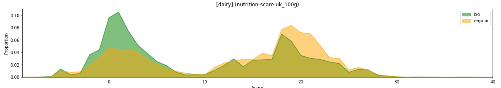
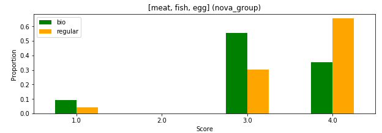

# Free Diving into Food Facts

\- 1: Want a fish!

\- 2: Yes?

\- 1: Alright, here ya go...

\- 2:  Weeeeee!!! But wait... some words are misspelled.

\- 1: Shut up.  

## Open Food Facts dataset - What is it?

The [Open Food Facts](https://fr.openfoodfacts.org/) dataset regroups millions of products from all around the world but contains mainly products from France and the USA. It provides insights on their composition, nutritional score, the place they are sold and many other information.  A complete list of all the fields available can be found [here](https://static.openfoodfacts.org/data/data-fields.txt).

There is even an [app](https://play.google.com/store/apps/details?id=org.openfoodfacts.scanner&hl=fr_CH) based on the dataset which allows the user to scan the bar-code of a product and immediately get an evaluation of the product. 

## Nutritional scores

Open Food Facts contains three scores that can be used to evaluate a product: 

- UK Food Standards Agency's (FSA)
- France
- nova

## Is Bio better?

Nowadays, most products come in two flavors: bio or non-bio. Consequently, while shopping, we are always confronted to bio products whose cost are about 20-40% higher compared to their non-bio equivalent. Such a price increase must imply a more responsible production and therefore better product quality. 

But are bio products really healthier? Let us try to get a first intuition by observing the score on bio and non-bio products for different food categories. 

To do so, we will observe groups of products that were chosen based on their categories. We can therefore compare meat related products or dairies independently. 

Let us start with their french nutrition grade:

Interestingly, while bio and non-bio scores distributions are similar, the bio products have greater proportions of products related to better scores while this tendency is inverted for the non-bio products. This is a first hint that bio products may indeed be healthier. 

What about another score? Let us look at what the UK nutrition score has to tell us:

The same conclusion arises from these last graphs. While both distributions have similar shape, bio products have larger proportions of products with better nutrition score than non-bio products. 

**But why is it the case actually? Why do bio products tend to be healthier?**

Does the degree of transformation of the products have something to do with it? Let us see if any tendency is observable:

Well... It does not seem the level of food processing has any real impact on the healthiness of a product. Bio as well as non-bio products are relatively strongly pre-processed. 

What about the additives then? They are often source of controversy, and some are even believed to be cancerous. Considering the same groups of products, let us observe the presence of additives in each category. 



That is interesting! The proportions of additives is in general drastically different when looking at bio products vs. regular ones. 

## Tout doux ma gueule

> **TODO:** Sum up the bar plots of the scores into box-plots or plots with error bars respectively. 

> **TODO:** What about some observations about the composition itself?

> **TODO:** Check if additives are included in the score computations or if they are simply correlated. 